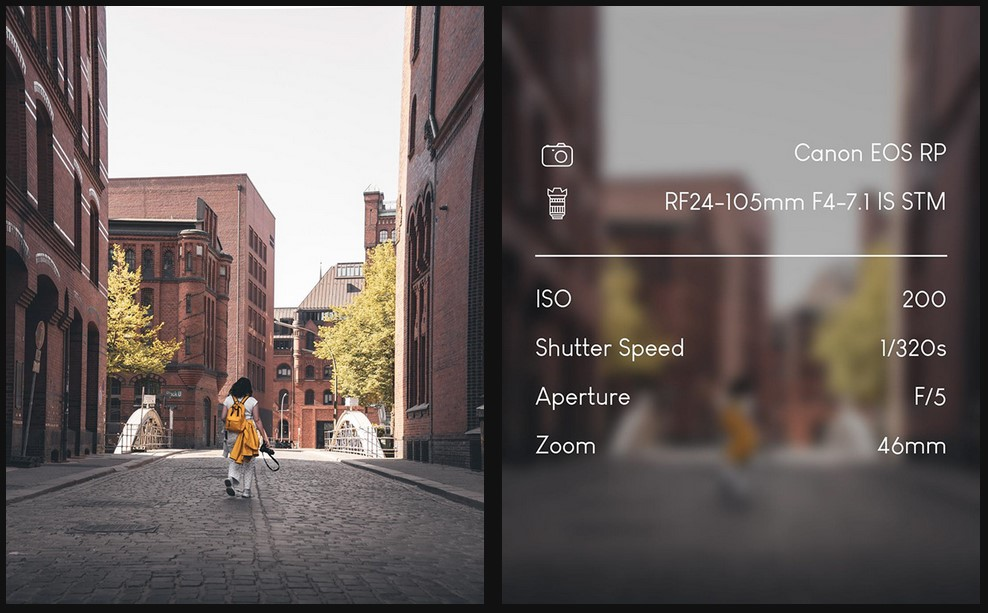
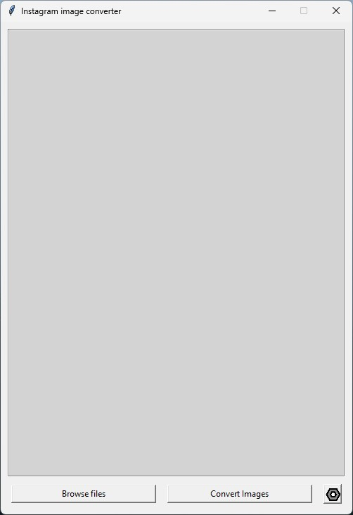
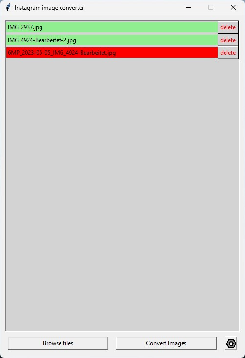
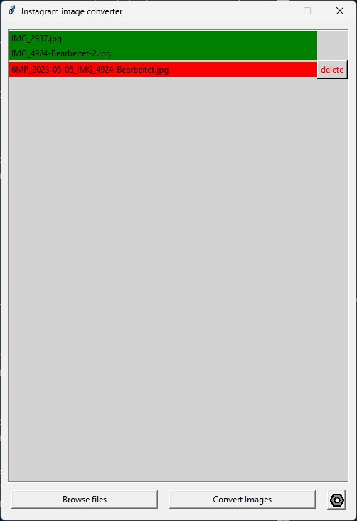
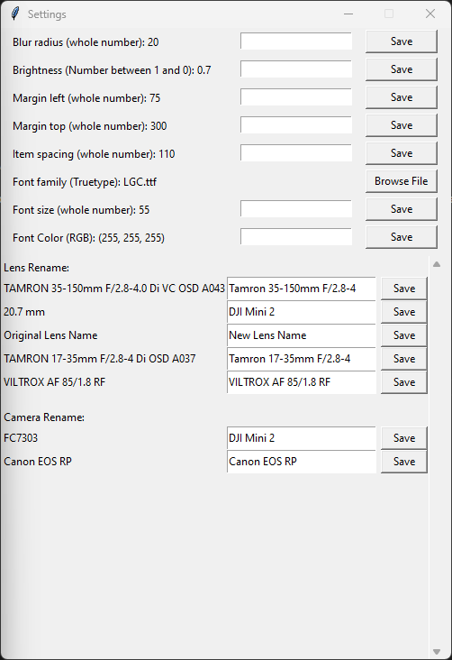

<a name="readme-top"></a>

<!-- PROJECT LOGO -->
<br />
<div align="center">
  <a href="https://github.com/JurIVoelker/Instagram-Post-Converter">
  </a>

<h3 align="center">Instagram Post Converter</h3>

  <p align="center">
    You are a photographer and want to create professional looking images for instagram that contains the metadata of the shot? The "Instagram Post Converter" reads meatadata from image, blurs that image, lowers exposure and writes the metadata on that image. 
    <br />
    <a href="https://github.com/JurIVoelker/Instagram-Post-Converter"><strong>Explore the docs »</strong></a>
    <br />
    <br />
    <a href="https://github.com/JurIVoelker/Instagram-Post-Converter">View Demo</a>
    ·
    <a href="https://github.com/JurIVoelker/Instagram-Post-Converter/issues">Report Bug</a>
    ·
    <a href="https://github.com/JurIVoelker/Instagram-Post-Converter/issues">Request Feature</a>
  </p>
</div>

<!-- ABOUT THE PROJECT -->
## About The Project



<p>This is an example of the usage of the software!</p>

### Used Python libraries
* pillow - for image processing 
* tkinter - for gui
* json - for managing settings
* math
* webbrowser - for running multiple python scripts
* os - for reading files
<p align="right">(<a href="#readme-top">back to top</a>)</p>


<!-- GETTING STARTED -->
## Getting Started

Clone the git repository and follow the installation instructions:

### Installation

* Clone the repo
   ```sh
   git clone https://github.com/JurIVoelker/Instagram-Post-Converter.git
   ```

* <a href="https://www.python.org/downloads/">Install Python</a>

* Install pillow library in cmd:
  ```sh
  pip install pillow
  ```
* The other libraries should be installed with python installation

* Double click the "instagramScondimage.py" and you're good to go

<p align="right">(<a href="#readme-top">back to top</a>)</p>


<!-- USAGE EXAMPLES -->
## Usage
### Basic Usage

<p>For starting the software, doubleclick the "instagramSecondimage.py" file. This should be the start screen:</p>



<p>For adding images that should be converted, press [Browse images] and add the images. Only jpeg images are compatible. Compatible images are colored green, uncompatible images are colored red. You can remove them by pressing "delete".</p>



<p>By pressing [Convert Images] you can convert the selected images. After conversion, the subfolder "finished" with the converted images is opened.</p>



### Settings
<p>By pressing the settings button, another window with the settings opens:</p>


<p>These are your possible settings:</p>

* Blur radius: Amount of background blur on image (whole number, default: 15)
* Brightness: Brightness of background (number between 1.0 and 0.0, default: 0.7)
* Margin left: Distance to the left and right edge of all items in pixles (whole number, default: 75)
* Margin top: Distance to the top edge of all items in pixles (whole number, default: 300)
* Item spacing: Distance distance between all items on y-axis (whole number, default: 110)
* Font Family: Font family of written text (true type font (ttf), default: "/resources/LGC.ttf")
* Font size: Size of written font (whole number, default: 55)
* Font Color: Color of written font ((r, g, b), default: (255,255,255))
* Lens Rename: Reads lens model (automatically when image is added) name which you can rename in the text field
* Camera Rename: Reads camera model (automatically when image is added) name which you can rename in the text field

<p align="right">(<a href="#readme-top">back to top</a>)</p>

<!-- CONTACT -->
## Contact
Juri Völker - kontakt@jurivoelker.de

Project Link: [https://github.com/JurIVoelker/Instagram-Post-Converter](https://github.com/JurIVoelker/Instagram-Post-Converter)

<p align="right">(<a href="#readme-top">back to top</a>)</p>


